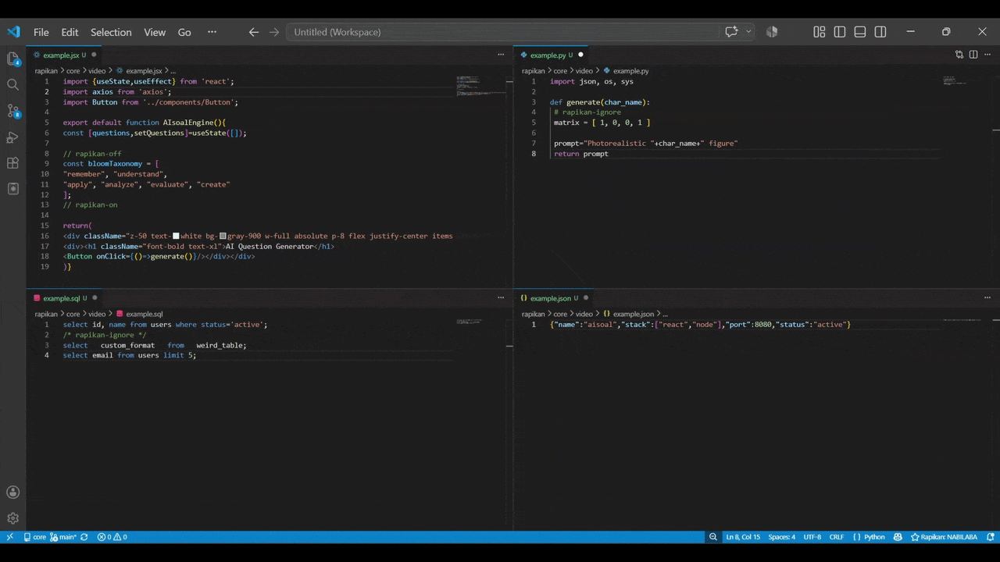

<div align="center">
  <h1>✨ Rapikan - Universal Code Formatter ✨</h1>
  <p><b>The Ultimate All-in-One Formatter for VS Code. Zero-config, Auto-downloading, and blazing fast formatting for 50+ languages without the extension bloat.</b></p>

</div>

<br/>



Are you tired of installing 15 different formatter extensions, battling with conflicting settings, and manually configuring environment paths for every language you use?

Meet **Rapikan** — the only VS Code formatter extension you will ever need. Designed for modern developers, Rapikan provides out-of-the-box, standardized code formatting for over 50 programming languages. Whether you are coding in Python, Java, PHP, C++, React, or Rust, Rapikan automatically manages the underlying formatting engines so you can focus on writing code.

---

## 📖 The Story Behind Rapikan

It all started because I struggled to find a simple Java and Kotlin formatter for VS Code. Getting them to work required tedious manual system installations like setting up `google-java-format` for Java and `ktlint` for Kotlin. So, I dug in and built a wrapper to handle those binaries automatically.

Then I wanted to add JS and TSX. Initially, I recklessly hardcoded the formatting logic from scratch! But it took way too much time. After doing some research, I realized Prettier is the standard and much more dev-friendly. So I scrapped my code, reworked it to use Prettier under the hood, and handled all the internal logic so it just works seamlessly.

Once I got Prettier integrated, I got carried away. Whenever I opened a new file type in VS Code and saw it wasn't formatted, I spontaneously added support for it. From Android Gradle scripts to various config files and backend languages. Before I knew it, hundreds of commits had passed, and the extension was orchestrating dozens of different formatters in one local system. To make this tool truly accessible globally, I also added multi-language support for its UI (English, Bahasa Indonesia, and 中文).

---

## ✨ See It in Action

Stop fighting with linters and multiple extensions. Just press `Shift + Alt + F` and watch the magic happen across 50+ languages.

### ❌ Before (Messy Code)

```javascript
function     calculate_Total ( a,b )  {
    if(a>0) {return a+ b;}
       else{   return 0 }
}
```

### ✅ After Rapikan

```javascript
function calculate_Total(a, b) {
  if (a > 0) {
    return a + b;
  } else {
    return 0;
  }
}
```

---

## 🚀 Why Choose Rapikan? (Key Features)

- ⚡ **Zero-Configuration Setup:** No need to tinker with `.rc` files or paths. Just install and format. Rapikan figures out the rest.
- ⬇️ **Smart Auto-Downloading:** The first time you format a file, Rapikan discreetly downloads the official, optimized formatter engine (e.g., `ruff`, `csharpier`, `taplo`) in the background. No global system installations required! _(Note: Language-specific toolchains like Go, Rust, Dart, and Swift elegantly utilize your existing System PATH)._
- 🧹 **Auto-Remove Comments:** A revolutionary feature to instantly clean up your codebase. Toggle "Auto-Remove Comments" to strip out unnecessary comments upon formatting, keeping your production code pristine.
- 🛡️ **Rapikan Code Vault (Ignore Regions):** Prevent specific blocks of code from being formatted or having comments removed using Rapikan's universal vault syntax:
  - `rapikan-ignore` (Single line ignore)
  - `rapikan-off` and `rapikan-on` (Block ignore)
- 🎨 **Built-in Tailwind CSS & Import Sorting:** Natively integrates Prettier's Tailwind plugin and Sort Imports functionality. Toggle them directly from the Rapikan Menu!
- 📊 100% Local Daily Wrap & Milestones: Gamify your productivity without compromising privacy. Rapikan securely counts your formatted files locally on your machine (zero telemetry) and generates a beautiful "Daily Wrap" image you can share on social media.

---

## 🌍 50+ Languages & Engines Supported

Rapikan bundles the power of industry-standard formatters into one unified experience.

| Language Category         | Supported Languages / Formats                                                                      | Underlying Engine (Auto-managed)           |
| :------------------------ | :------------------------------------------------------------------------------------------------- | :----------------------------------------- |
| **Web & JavaScript**      | JavaScript, TypeScript, JSX, TSX, JSON, JSONC, JSON5, HTML, CSS, SCSS, LESS, Vue, Angular, GraphQL | `Prettier` (with plugins)                  |
| **Python & Data**         | Python (`.py`, `.pyi`), R                                                                          | `Ruff`, `Air`                              |
| **Java & C#**             | Java, C# (`.cs`)                                                                                   | `google-java-format`, `CSharpier`          |
| **C / C++ / System**      | C, C++, Objective-C, Objective-C++, CMake                                                          | `clang-format`, `cmakefmt`                 |
| **Go & Rust**             | Go, Rust                                                                                           | `goimports`, `rustfmt`                     |
| **PHP & Laravel**         | PHP, Blade (`.blade.php`)                                                                          | `Prettier PHP`, `Prettier Blade`           |
| **Ruby, Elixir & Lua**    | Elixir, Phoenix Heex, Lua                                                                          | `mix format`, `StyLua`                     |
| **Mobile & Apple**        | Swift, Dart, Kotlin, ProGuard                                                                      | `swift-format`, `dart format`, `ktlint`    |
| **Modern Web Frameworks** | Svelte, Astro, Pug / Jade                                                                          | `Prettier Svelte/Astro/Pug`                |
| **DevOps & Configs**      | Dockerfile, Terraform, YAML, TOML, INI, Properties, EditorConfig, `.env`, `.ignore`, Nginx         | `Rapikan Native`, `Terraform fmt`, `Taplo` |
| **Database & Shell**      | SQL, Shell / Bash (`.sh`, `.bash`), Windows Batch (`.bat`), Prisma                                 | `sql-formatter`, `shfmt`, `Rapikan Batch`  |
| **Others**                | Zig, Visual Basic, XML, Gradle, Groovy                                                             | `zig fmt`, `Rapikan Native XML/VB`         |

---

## 🛠️ How to Use

1. Open any supported file in VS Code (or compatible IDEs like Cursor, Windsurf, VSCodium, etc.).
2. Press `Shift + Alt + F` (Windows/Linux) or `Shift + Option + F` (Mac).
3. **That's it!** If it's your first time formatting that language, Rapikan will download the engine automatically.

### 🎛️ The Rapikan Menu

Access the interactive Quick Menu by clicking the **Rapikan** badge in the bottom right status bar, or by running the command `Rapikan: Show Menu`.
From here, you can toggle Tailwind CSS Sorting, Auto-Sort Imports, Auto-Remove Comments, view your Daily Wrap, or change the extension display language.

---

## 🔒 Rapikan Vault: Protect Your Code

Don't want Rapikan to format a specific tricky function? Wrap it in Rapikan Vault comments. The syntax adapts to the language you are using automatically!

**JavaScript / CSS / C++ (C-Style)**

```javascript
/* rapikan-off */
const messyMatrix = [
  1,0,0,
  0,1,0,
  0,0,1
];
/* rapikan-on */

const a = 1; // rapikan-ignore
```

**Python / Shell / YAML (Hash-Style)**

```python
# rapikan-off
def     messy_func():
      pass
# rapikan-on
```

**HTML / XML / Vue / Astro**

```html
<!-- rapikan-off -->
<div    class="messy"  ></div>
<!-- rapikan-on -->
```

---

## 💼 Pricing Philosophy & Commercial License

**Honestly, I've survived on free tools since junior high**, so I want to give back to the community. Therefore, Rapikan operates on a transparent dual-license model:

**1. Personal & Open Source (100% FREE)**
Rapikan is strictly **100% FREE** with no feature locks for personal use, students, hobbyists, and open-source projects.

_The 500 Files Milestone:_ After Rapikan formats 500 files for you, the status bar badge will quietly change to "Trial". **It does NOT lock your features.** It just serves as a polite reminder of the commercial licensing terms.

**2. Commercial Pro License**
A Commercial Pro License ($9/month or $49/year per seat) is legally REQUIRED if you are using Rapikan within a company that meets **ANY** of the following criteria:

- Has more than five (5) employees.
- Has an annual gross revenue exceeding $50,000 USD.
- Has received external venture funding or angel investment.

Tech ecosystems constantly change, and this recurring support allows me to maintain these 50+ underlying binaries long-term. Your company saves countless hours of setup time, and you directly support a solo developer's work.

_(Note: Our payment gateway is currently under final verification. Commercial licenses will be available for purchase very soon!)_

### 💖 Just want to support the project?

If you are a free/individual user who finds Rapikan helpful and wants to support my work without purchasing a commercial license, every tip keeps the development alive!

- [Sponsor on Ko-fi (Global)](https://www.google.com/search?q=https://ko-fi.com/nabilaba)
- [Support via Saweria (Local QRIS/GoPay)](https://saweria.co/nabilaba)

Visit [rapikan.nabilaba.my.id](https://rapikan.nabilaba.my.id) to read the full EULA and learn more.

---

## 🏷️ Tags / Keywords

_Code formatter, VS Code formatter, Prettier alternative, auto format code, Python formatter, Java formatter, PHP formatter, C++ formatter, Tailwind CSS sorter, Sort Imports, multi-language formatter, remove comments extension, code cleanup, Ruff, CSharpier, StyLua, ktlint, goimports, taplo._

---

**Made with ❤️ by Rapikan.**
